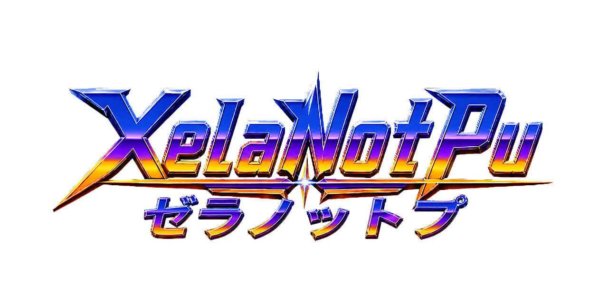

  

# Namco System 11 for MiSTer

FPGA implementation of the [Namco System 11](https://en.wikipedia.org/wiki/Namco_System_11) arcade board for the [MiSTer platform](https://github.com/MiSTer-devel/Main_MiSTer/wiki).

Namco System 11 (1994) is an arcade board built around Sony PlayStation technology: an R3000A-compatible MIPS CPU, a System 11 GPU (CXD8538Q) with 2 MB VRAM, and main RAM — paired with Namco-specific hardware that has no PlayStation equivalent: banked game ROM in place of a CD drive, a Namco C76 (Mitsubishi M37702) MCU handling sound and cabinet I/O, the Namco C352 32-voice PCM sound chip, and per-game KEYCUS protection chips. This core implements all of the above, including the C76 coprocessor and C352 sound.

The core is derived from the excellent [PSX_MiSTer](https://github.com/MiSTer-devel/PSX_MiSTer) core by **Robert Peip (FPGAzumSpass)**, which provides the CPU, GPU, GTE, DMA, and memory subsystem foundation.

## New in 20260911 (supporter edition)

- **The OSD no longer pauses the game by default.** A new OSD option —
  **"Pause when OSD is open"** (default **Off**) — controls it: leave it Off and
  the game keeps running, sound and all, while you're in the menu; switch it On
  to get the old freeze-on-menu behavior back. The Pause button (and its
  supporter credits screen) is unchanged.
- **Development instrumentation removed from every edition** — the Debug OSD
  page and all JTAG/diagnostic logic are gone from this build too, matching
  the standard edition. The supporter features (DB9/DB15, CRT Adjust, pause
  screen) are all still here; a leaner core is all you should notice.

The core file is `Arcade-XNSYSTEM11_20260911.rbf`. Everything below from
20260902 carries over.

## New in 20260902 (supporter edition)

- **★ DB9/DB15 buttons fixed.** Several of you reported wrong button behavior on
  DB9/DB15 sticks — and you were being kind: the buttons (Start and Coin
  included) were completely dead, with only the D-pad working. The button-remap
  matrix powers up empty and expected an initialization the core never sent.
  Three independent code reviews converged on the same root cause; the core now
  loads the correct identity map itself at power-up, so **every button works
  with stock MiSTer firmware**. If you run a physical splitter and stick, your
  confirmation in the comments is genuinely valuable — that's the one test this
  lab cannot run.
- **Tekken 2 alternate revisions fixed**: the six older revisions (TES1/TES2/
  TES3 VER.A/B/C) run on the coh100 board with the earlier CXD8538Q GPU; the
  core now selects the correct GPU type via their MRAs, fixing the corrupt
  graphics those versions showed (verified on hardware). The primary
  TES2-VER.D was always correct.
- **Accurate cabinet inputs**: DIP switches carry MAME's exact names —
  "DIP1 (Test)" enters each game's service menu, "DIP2 (Freeze)" freezes — and
  the cabinet Service button is now mappable (OSD → Define buttons).
- **Game-appropriate button labels** in every MRA (Tekken LP/RP/LK/RK,
  Soul Edge Horizontal/Vertical/Kick/Guard, Point Blank 2 Trigger, and so on).
- **Light-gun options only for light-gun games**: the Light Gun OSD page and gun
  input now appear only for Point Blank 2 and Gunbarl.
- **Pause-screen supporter credits refreshed** to the current list — if you're
  on it, thank you; that's you on real hardware.

## Supporter features

### CRT Adjust (analog geometry)

**CRT Adjust** (OSD page): H-Size / H-Position / V-Shift for analog CRTs,
adjustable live — the picture moves while sync stays native, so the tube never
loses lock. Default **Off** (HDMI/analog untouched). Credit: rmonic79's
MiSTer-CRT-Adjust.

### DB9 / SNAC8 joystick support

**UserIO Joystick** OSD option enables DB9MD Megadrive (3/6-button) and DB15
Neo-Geo/Supergun sticks via Antonio Villena splitters on the user port. Up to
2 players. In-game input works with stock MiSTer firmware; navigating the OSD
from the stick itself needs the MiSTer-DB9 project's Main_MiSTer and menu.rbf
(Start+C opens the menu). The 8th user-port line this needs is the pin the rare
secondary SPI-SD add-on used, so that add-on is not supported by this edition.

### Pause screen

The pause overlay shows the current supporter credits with color-coded tiers.

## Games

Primary titles (one per game; other regions/revisions live in `releases/_Arcade/_alternatives/_<Game>/`):

- Tekken (TE2 Ver.C)
- Tekken 2 Ver.B (TES2-VER.D)
- Soul Edge Ver. II (SO4-VER.C)
- Xevious 3D/G (XV32-VER.B)
- Dunk Mania (DM2-VER.C)
- Prime Goal EX (PG1-VER.A)
- Dancing Eyes (DC2-VER.B)
- Star Sweep (STP1-VER.A)
- Kosodate Quiz My Angel 3 (KQT1-VER.A)
- Pocket Racer (Japan PKR1-VER.B)
- Point Blank 2 (World GNB2-VER.A)
- Gunbarl (Japan GNB1-VER.A)

*(+24 alternate region/revision MRAs under `releases/_Arcade/_alternatives/`; Gunbarl, the Japanese release of Point Blank 2, ships under `_alternatives/_Point Blank 2/`.)*
**Family Bowl** remains out of scope

## Install

Copy the `_Arcade/` folder onto your SD card's root folder: this places the `.mra` files (and `_alternatives/`) directly in `_Arcade/`, and `cores/Arcade-SYSTEM11_20260911.rbf` in `_Arcade/cores/`. **Remove stale `XNSYSTEM11_*` cores and MRAs from earlier builds** — they reference the retired name. **Provide your own romsets — nothing copyrighted is included.**

MRAs reference romsets by name only.

## Credits & attribution

This core stands on the work of others, gratefully acknowledged:

- **PSX_MiSTer** by **Robert Peip (FPGAzumSpass)** — the PlayStation core this System 11 core derives from, providing the R3000A CPU, GPU, GTE, DMA, and memory subsystem.
- **The MiSTer project** and its framework (`sys/`) — Alexey Melnikov (**Sorgelig**) and the MiSTer-devel contributors.
- **MiSTer-CRT-Adjust** — rmonic79 (with Andrea Bogazzi) — the core-side analog CRT geometry module used for H-Size / H-Position / V-Shift.
- **MiSTer-DB9 project** — Aitor Pelaez (**NeuroRulez**), Victor Trucco, Fernando Mosquera, Timothy Redaelli, and Antonio Villena (DB9 splitter hardware design) — the joystick adapter and controller framework.
- **C76 M37702 / C352 / KEYCUS** — original FPGA re-implementations of System 11's sound and security hardware.
- **The MAME project** — the hardware documentation and reference behavior used to develop System 11 board support (per-manufacturer boot ROM, CAT702 security, ROM banking, NVRAM/EEPROM) as an independent re-implementation.
- **System 11 hardware and chipset re-implementations** — **XelaNotPu**: the System 11 hardware (per-manufacturer boot ROM, CAT702 security, ROM banking, NVRAM/EEPROM), the sound-chip re-implementations (C76 M37702, C352), and the XN pause-overlay artwork and README banner.

## License

This core is a combined/derived work licensed under the **GNU General Public License, version 3 or later (GPLv3-or-later)**.

It builds on [PSX_MiSTer](https://github.com/MiSTer-devel/PSX_MiSTer) (Robert Peip) and the MiSTer framework. Several files in the build tree — the MiSTer `sys/` HPS-I/O, SD-card, scandoubler and DDR-service modules, and the SDRAM/DDR memory controllers — are licensed **GPL version 3 or later**. The joystick driver modules (joydb) derive from the MiSTer-DB9 project (GPLv2), compatible with this combination. Combining GPLv2-or-later code with GPLv3-or-later code yields a work that can only be conveyed under GPLv3-or-later, so that is the license of this core as a whole. The full texts of both licenses are included (`COPYING.GPL2`, `COPYING.GPL3`); GPLv2-or-later files remain individually available under their own terms.

## Legal

**No ROMs.** This repository contains no game ROMs and no copyrighted game data, and it provides no links or instructions for obtaining them. To use this core you must supply your own ROM dumps, made from original hardware or media that you legally own, where and to the extent your local law permits.

**Trademarks.** "Namco", "System 11", "Tekken", and related names and logos are trademarks or registered trademarks of Bandai Namco Entertainment Inc. and/or their respective owners. "PlayStation" is a trademark of Sony Interactive Entertainment Inc. This project is not affiliated with, endorsed by, or sponsored by Bandai Namco, Sony Interactive Entertainment, or any other rights holder. Such names are used here in a purely nominative and descriptive manner, solely to identify the hardware being re-implemented.

**Purpose.** This is an independent, non-commercial hardware-preservation and interoperability project. The FPGA logic is an original re-implementation of the System 11 board's behavior, developed from observation and from publicly available documentation and references (including the MAME project's hardware documentation); it contains no proprietary source code from the original manufacturers.

**Security-chip emulation.** Namco System 11 boards used per-game KEYCUS chips (C406, C409, …) as a protection measure. This core re-implements that logic for interoperability and preservation, in the same manner as MAME and comparable FPGA cores. The KEYCUS is a small challenge/response algorithm rather than stored key data, so no manufacturer key material is embedded in the bitstream. Laws such as the U.S. DMCA §1201 address circumvention of technological protection measures; whether and how they apply to this kind of preservation/interoperability use can depend on your jurisdiction and circumstances. Users are responsible for their own compliance.

**User responsibility.** Users are solely responsible for ensuring that their use of this core — including the acquisition and use of any ROM images — complies with copyright law and all other applicable laws in their jurisdiction.

**No warranty.** As set out in sections 15–16 of the GNU General Public License (v3) and the equivalent clauses of v2: THIS PROGRAM IS PROVIDED "AS IS" WITHOUT WARRANTY OF ANY KIND, EITHER EXPRESSED OR IMPLIED, INCLUDING, BUT NOT LIMITED TO, THE IMPLIED WARRANTIES OF MERCHANTABILITY AND FITNESS FOR A PARTICULAR PURPOSE. THE ENTIRE RISK AS TO THE QUALITY AND PERFORMANCE OF THE PROGRAM IS WITH YOU. IN NO EVENT WILL ANY COPYRIGHT HOLDER OR CONTRIBUTOR BE LIABLE TO YOU FOR DAMAGES, INCLUDING ANY GENERAL, SPECIAL, INCIDENTAL OR CONSEQUENTIAL DAMAGES ARISING OUT OF THE USE OR INABILITY TO USE THIS PROGRAM, EVEN IF ADVISED OF THE POSSIBILITY OF SUCH DAMAGES.
